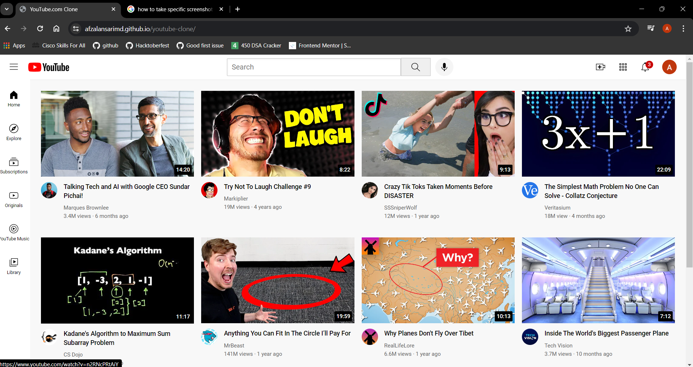
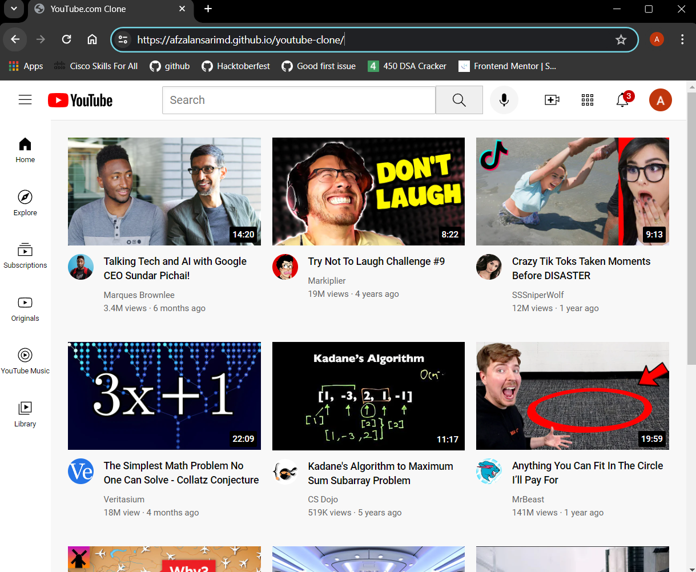
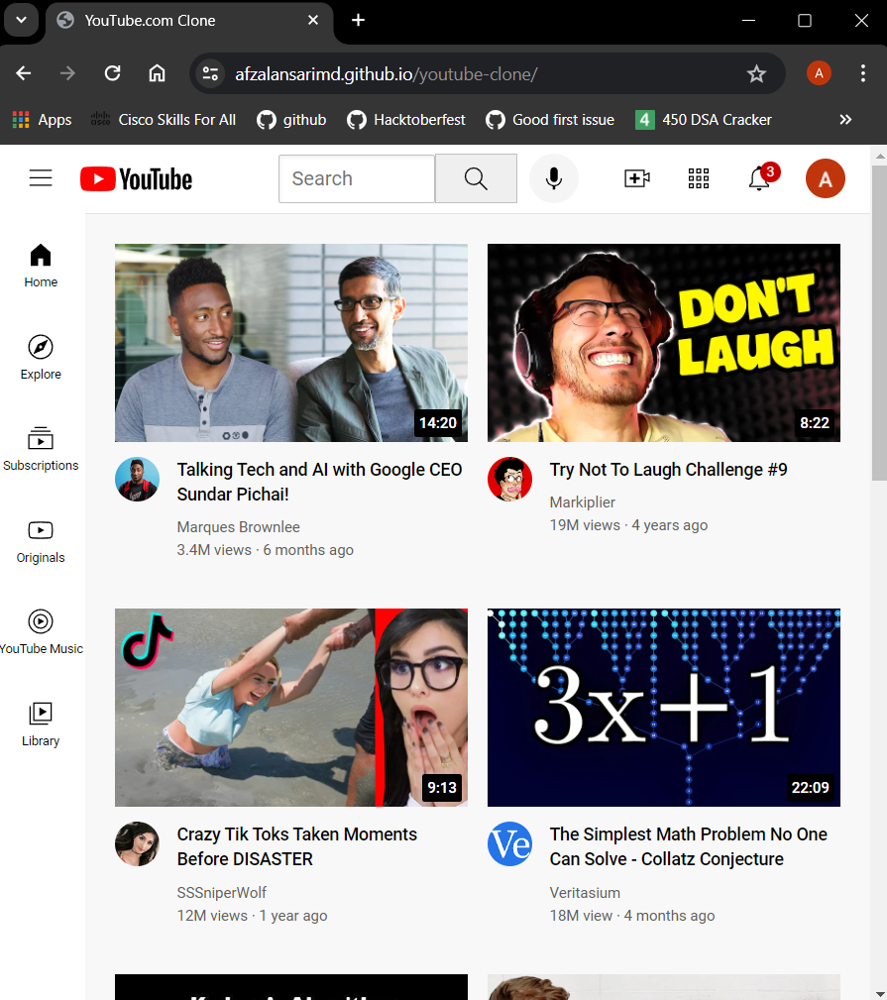

<div id="top"></div>

# Youtube-clone

<details>
<summary>Table of contents</summary>

-   [Overview](#overview)
-   [Technology Stack](#technology-stack)
-   [Getting Started](#getting-started)
-   [Features](#features)
-   [Screenshots](#screenshots)
-   [Link](#link)

</details>

## Overview


Building a simple YouTube-like website with HTML for structure, CSS for styling, and grid/flex layouts for a modern responsive design.

## Technology Stack


- HTML
- CSS
  


## Getting Started

1. Clone the repository:

   ```bash
   https://github.com/AfzalAnsariMd/youtube-clone.git
   cd youtube-clone

   ```


## Features

- **Modern & Responsive**: Uses new CSS layouts (grid & flex) for a design that adapts to different screens (phones, tablets, computers).

- **Simple & Clean**: Focuses on essential elements, keeping the YouTube-inspired look sleek and user-friendly.

- **Interactive Practice**: Lets you experiment with modern CSS layouts for a hands-on learning experience.


## Screenshots

<table>
    <tr>
        <th>Desktop View</th>
    </tr>
    <tr>
      <td colspan="3" style="text-align: left; font-weight: bold;">Home</td>
    </tr>
    <tr>
        <td>
            
        </td>
    </tr>
    <tr>
      <td colspan="3" style="text-align: left; font-weight: bold;">Medium-Screen View</td>
    </tr>
    <tr>
        <td>
            
        </td>
    </tr>
    <tr>
      <td colspan="3" style="text-align: left; font-weight: bold;">Small-Screen View</td>
    </tr>
    <tr>
        <td>
            
        </td>
    </tr>
    <tr>
      <td colspan="3" style="text-align: left; font-weight: bold;"></td>
    </tr>
    <tr>
      <td colspan="3" style="text-align: left; font-weight: bold;"></td>
    </tr>
</table>

## Link
[🚀 Live Page](https://afzalansarimd.github.io/youtube-clone/)

<p align="right"><a href="#top">⬆️ Back to Top</a></p>
